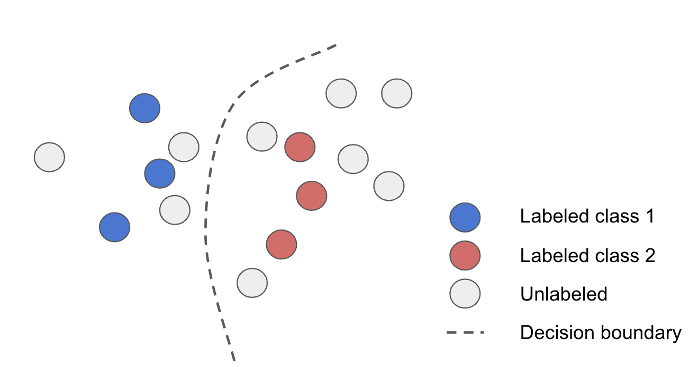
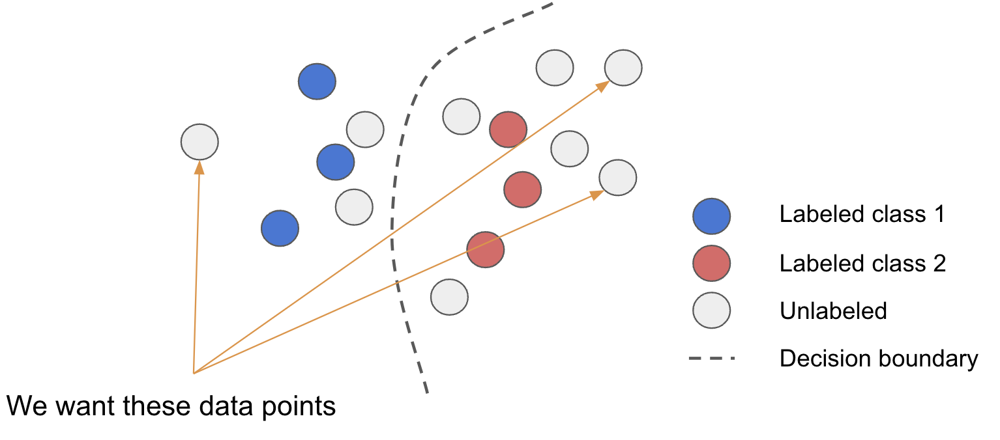

## Active Learning

How do you improve a model ? Try new architectures ? Fine tune the hyper parameters ?
Recently, the industry realised that rather than trying to work on the model, focusing on data was far more effective.

Dioptra supports a Data Centric approach to model imporvement.
We help ML team systematically engineer their data to get the best performance out or their models.

Active Learning is teh bethod by which we select the best data to add to teh retraining cycle to maximise improvement outcome while minimizing labeling and training costs.

Here is the question. Given the following state of your model, how do you pick the best data to retrain ?



The answer is that it depends on what model waekness you are trying to fix. 
Dioptra supports several techniques, each designed to fix a kind of model waekness.
They can and should be combined to maximise the breath of model improvement at each retraining.

### Uncertainty Sampling

When the model is confused about in domain data, we can use uncertainty sampling to detect the confusing unlabeled data.
This data is going to be close to the decision boundary.


We leverage several techniques to locate this data:

- confidence sampling

Probably the most straighforward active learning technique. It consists in sampling low confidence samples
The drawback of confidence sampling is that only look at the confidence of the predicted class

``` Data field requirements
   'confidence'
   or 'confidences'
   or 'logits'
```
``` Query


```

- entropy sampling

In cases where there are many classes, looking at the confidence of the predicted class is not enough
We need to look at the level of confidence of all classes
To do this, we compute the entropy of the confidence vector.
This tec either the `confidences` field or `logits` fields to be passes in the predictions

``` Data field requirements
   'confidences' 
   or 'logits'
```
``` Query


```

- Query By Committee

Another alternative to model uncertainty is use leverage Query By Committee.
This techniques consists in training several models with the same architecture on separate data folds and have them predict on the same data point as the main model. This technique has the advantage to be applicable regardless of the model architecture and model uncertainty for all model outputs (class uncertainty, bbox location uncertainty etc.)

``` Data field requirements
   'query_by_committee'
```
``` Query


```

- Monte Carlo Dropout

Similar to Query By Committee MC Dropout models uncertainty by comparing several model output with each other.
But, while Query By Committee requires several trainings, MC Dropout generates candidate predictions by activating the dropout layer at inference time.

This technique is gaining popularity in recent years as a good way to approximate uncertainty while minimising training costs.
More details [here](https://arxiv.org/abs/1506.02142)

To setup your model to perform MC Dropout, set your dropout layers in training mode while running inference and call the model several times to generate different predictions.

```python Pytorch
for m in model.modules():
    if m.__class__.__name__.startswith('Dropout'):
        m.train()
```

Or wrap the Dropout layer in a custom layer

```python Tensorflow
class MonteCarloDropout(keras.layers.Dropout):
  def call(self, inputs):
    return super().call(inputs, training=True)
```

``` Data field requirements
   'mc_dropout'
```
``` Query


```

### Diversity Sampling

When the model is infering on Out Of Domain data (drift), the uncertainty of the model cannot be trusted
To discover OODs and Drifted data, we need to find data far from the training data



To discover these datapoints, we leverage two types of techniques

- Embedding distance

The first way is to measure the distance from the training dataset in the embedding space or to leverage a novelty detection algorithm to find data that are out of distribution. 
Both techniques rely on embedding distances.

``` Data field requirements
   'embeddings'
```
``` Embedding Distance Miner


```
``` Novelty detection Miner


```

These techniques are proven effective to catch far OODs but can be biased by the quality and biaseness of the embedding space.
We recommend experimenting with different embedding layers, bearing in mind that the lower levers are going to remain relatively stable across tasks but will be generic, while the upper level will have greater discriminatory power but can become biased towards the task.

- Activation levels

Another way to detect OODs is to look at the activation levels in the model while it makes a prediction.
This is indicative of the amount of information the model is using to make a decision.
This technique has proven to be the most effective but is less explainable and model specific.
``` Data field requirements
   'embeddings' // will focus on semantic activation
   or 'logits' // will focus on prediction activation
```
``` Activation Miner


```
