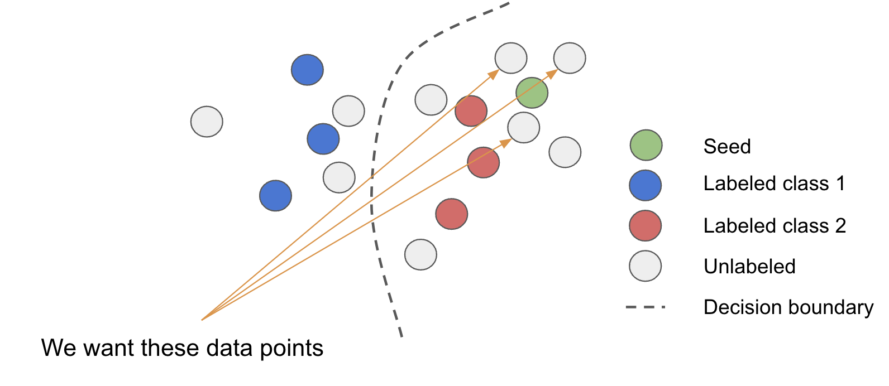
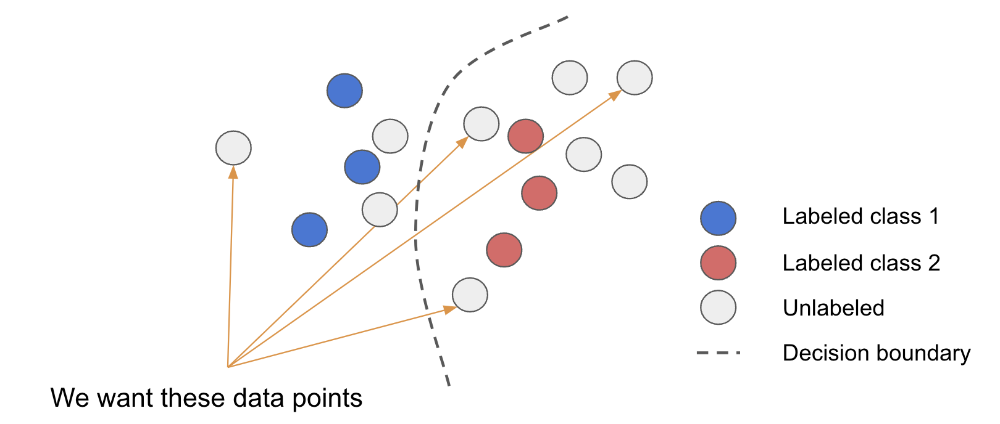

## Active Learning

How do you improve a model ? Try new architectures ? Fine tune the hyper parameters ?
Recently, the industry realised that rather than trying to work on the model, focusing on data was far more effective.

Dioptra supports a Data Centric approach to model imporvement.
We help ML team systematically engineer their data to get the best performance out or their models.

Active Learning is the method by which we select the best data to add to the retraining cycle to maximise improvement outcome while minimizing labeling and training costs.

Here is the question. Given the following state of your model, how do you pick the best data to retrain ?


The answer is that it depends on what model waekness you are trying to fix.
Dioptra develops techniques designed to fix specific kind of waekness.
They can and should be combined to maximise the breath of model improvement at each retraining.

### Uncertainty Sampling

When the model is confused about in domain data, we can use uncertainty sampling to detect confusing unlabeled data.
This data is going to be close to the decision boundary.


- confidence sampling

Probably the most straighforward active learning technique. It consists in sampling low confidence samples.
The drawback of confidence sampling is that only look at the confidence of the predicted class.

- entropy sampling

In cases where there are many classes, looking at the confidence of the predicted class is not enough.
We need to look at the level of confidence of all classes.
To do this, we compute the entropy of the confidence vector and sample for high entropy.
As a reminder, `entropy = 0` when there is no uncertainty and `entropy = 1` when the uncertainty is maximal.

- Query By Committee (coming soon)

Another alternative to model uncertainty is use leverage Query By Committee.
This techniques consists in training several models and have them predict on the same data point to compare their prediction.
There are several techniques to produce such committee, one of them being to train the same model on separate data folds.
This technique has the advantage to be applicable regardless of the model type and will model uncertainty all model outputs: classes, boxes etc.

- Monte Carlo Dropout (coming soon)

Similar to Query By Committee MC Dropout models uncertainty by comparing several model output with each other.
But, while Query By Committee requires several trainings, MC Dropout generates candidate predictions by activating the dropout layer at inference time. Doing so, we generate an approximate Bayesian inference which has provent to effectively model uncertainty in NN.

More details [here](https://arxiv.org/abs/1506.02142)

To setup your model to perform MC Dropout, set your dropout layers in training mode while running inference and call the model several times to generate different predictions.

```python
# Pytorch
for m in model.modules():
    if m.__class__.__name__.startswith('Dropout'):
        m.train()
```

Or wrap the Dropout layer in a custom layer

```python
# Tensorflow
class MonteCarloDropout(keras.layers.Dropout):
  def call(self, inputs):
    return super().call(inputs, training=True)
```

### Diversity Sampling

To discover Out Of Domain data, we need to sample data that are far from the training data and that won't be caught by uncertainty sampling.


To discover these datapoints, we leverage techniques based on embeddings and model activation.

- Embedding distance (coming soon)

This technique measures the distance from the training dataset in the embedding space and returns the data that are the farthest away from it.

- Novelty detection

The drawback of the embedding distance is that it doesn't account for data density. A single training datapoint will cover large partion of the training set.

To compensate for that, Dioptra leverages a novelty detection algorithm trained on the training set and infered on the unlabeled set to detect unlabeled data un areas of low training data density.

- Outlier detection

In certain cases, edge cases can be zeroed downt to by filtering down to a small subset of data that looks similar and looking for outliers in this space. We implement an outlier detection sampling technique based on Local Outlier Factor.

These techniques have proven effective to catch far OODs and can be biased by the quality and biaseness of the embedding space.
We recommend experimenting with different embedding layers, bearing in mind that the lower levers are going to remain relatively stable across tasks but will be generic, while the upper level will have greater discriminatory power but can become biased towards the task.

- Activation levels

Another way to detect OODs is to look at the activation levels in the model while it makes a prediction.
This is indicative of the amount of information the model is using to make a decision.
This technique has proven to be the most effective but is less explainable and model specific.

### Similarity Sampling

One of the most common pattern in data curation is to find a seed (edge case, feedback from end users etc.) and look for similar data.
You can do this by using our KNN miners.



### Density Sampling

One of the draw back of AL techniques is that they tend to sample similar data because they share the same properties.
To compensate for that, we look can sample the output of a miner to find the most differentiable data.
We use the [coreset](https://arxiv.org/abs/1708.00489) algorithm for that.


